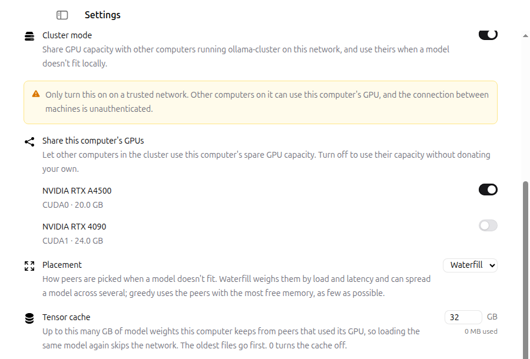

`ollama-cluster` lets a group of machines on the same LAN share GPU capacity
for a single inference request, using [llama.cpp's RPC
backend](https://github.com/ggml-org/llama.cpp/blob/master/tools/rpc/README.md).
When a model doesn't fit in one machine's VRAM, layers spill onto another
machine's spare GPU automatically — no manual `--rpc` flags, no static peer
list.

This is off by default and opt-in per machine.

The scaling axis is model size, not request throughput: one head still
drives each request (see [How it's different from
EXO](#how-its-different-from-exo) below), but that model's layers can
spread across as many peers' free VRAM as it takes, on whatever backend
each peer happens to run. Scale out with more/older machines instead of
up with one bigger, matching GPU.

Peers don't need matching hardware: `ollama cluster ls` reports each
machine's actual backend and free VRAM, measured live, and placement uses
that instead of assuming a homogeneous rack.

## How it's different from EXO

If you've used [EXO](https://github.com/exo-explore/exo): the peer-discovery
and zero-config idea is the same, but the topology isn't. llama.cpp's RPC
protocol is client/server with no worker-to-worker traffic — a worker only
ever talks to the machine that's driving the current request, never to
another worker. So `ollama-cluster` is hub-and-spoke, not a mesh: one machine
is the head for a given request (running `llama-server`, deciding the split)
and the rest are spare capacity it borrows. Any machine can be the head for
its own requests while donating capacity to someone else's at the same time,
but there's no ring/mesh scaling across many hops the way EXO's peer
election does. For most home/office LANs (a handful of boxes) this has no
practical downside; it's a real ceiling if you're trying to pool a much
larger number of nodes.

## Enabling it

On a machine where Ollama is already running (a Linux systemd service, or
`ollama serve` in another terminal):

```shell
ollama cluster on
```

This takes effect right away, with no restart, and is saved in the
server's `~/.ollama/server.json`, so it survives restarts. For the Linux
service that file is `/usr/share/ollama/.ollama/server.json`: the server
writes it itself, so it lands in the right place whichever user runs the
service. `ollama cluster off` turns it off again, and `ollama cluster
status` shows every cluster setting and where it comes from, followed by
this machine's GPUs, one per line, with the device name `share-devices`
takes and whether peers can use it. The other
settings in the table below are changed the same way:

```shell
ollama cluster set share off                # use peers' GPUs without sharing this one
ollama cluster set share-devices CUDA1      # share only this GPU ("" = all)
ollama cluster set seeds 192.0.2.10:11435   # "" clears
ollama cluster set placement greedy
ollama cluster set cache-gb 64
```

These only work from the machine the server runs on. A server exposed
with `OLLAMA_HOST=0.0.0.0` refuses them from anywhere else, since cluster
mode offers this machine's GPU to the whole LAN (see
[Security](#security)).

Or, when starting the server by hand:

```shell
OLLAMA_CLUSTER=1 ollama serve
```

Do this on every machine that should participate. Each instance broadcasts
a discovery beacon on the LAN and builds a table of peers automatically —
nothing to configure on a same-subnet network.

Once two or more instances have cluster mode on, a request
for a model that doesn't fit locally will automatically pick a peer with
free GPU memory and pass it to `llama-server` as an RPC worker.

## Desktop app

The desktop app (macOS and Windows) has a Cluster mode section in Settings,
right below "Expose Ollama to the network". It changes the same settings as
`ollama cluster on/off/set` (see [Enabling it](#enabling-it)): the app's
`ollama serve` saves them in `~/.ollama/server.json` and applies them
without a restart, so the app, the menu and the command line always agree.
The switches map onto:



- **Cluster mode** -- `OLLAMA_CLUSTER`.
- **Share this computer's GPUs** -- one switch per GPU, labelled with
  its name, ggml device name and memory (disabled while cluster mode is
  off). All on shares every GPU (`OLLAMA_CLUSTER_SHARE` on,
  `OLLAMA_CLUSTER_SHARE_DEVICES` empty); some on shares only those
  (`OLLAMA_CLUSTER_SHARE_DEVICES` set to their names); all off turns
  `OLLAMA_CLUSTER_SHARE` off. On a machine without a GPU it is a single
  **Share this computer's CPU** switch. The switches are locked when
  either variable is set in the environment.
- **Placement** -- `OLLAMA_CLUSTER_PLACEMENT`, Waterfill (the default) or
  Greedy (disabled while cluster mode is off).
- **Tensor cache** -- `OLLAMA_CLUSTER_CACHE_GB`, the cache's size cap in GB;
  0 turns it off (disabled while cluster mode or sharing is off).
- **Peers on other subnets** -- `OLLAMA_CLUSTER_SEEDS`, a comma-separated
  `host:port` list; rejected with an inline error if it doesn't parse as
  that.

On macOS, the menu-bar menu has a **Cluster Mode** item and one share item
per GPU, like the Settings page: **Share \<GPU name\>** for each GPU (with
the device name added if two GPUs have the same name), **Share the \<GPU
name\> GPU** on a machine with one, or **Share this computer's CPU** on a
machine without. Each has a green (on) or red (off) dot; click one to
switch it. A **Placement** submenu below them picks the placement policy.
macOS asks once
whether Ollama may find devices on local networks; discovery needs that
allowed (System Settings > Privacy & Security > Local Network).

The panel also polls this instance's `ollama cluster ls` equivalent every
few seconds while cluster mode is on, showing peers and any model spillover
onto them the same way `ollama ps` does, and always shows the
trusted-network warning above.

An `OLLAMA_CLUSTER*` variable in the server's environment (launchd, a
service environment) still wins. The app then shows that setting locked,
with a note naming the variable, and the menu item is greyed out with the
same explanation in its tooltip.

## Listing peers

```shell
ollama cluster ls
```

Lists the peers this instance currently sees on the LAN: address, whether
they're sharing spare GPU capacity, their devices and free memory, load,
measured round-trip latency, and when they were last seen. Says so plainly
if `OLLAMA_CLUSTER` isn't on for this instance, rather than printing an
empty table.

Peers report whatever backend their own `ollama serve` was built with —
a cluster can mix CUDA, Vulkan and Metal machines freely, since RPC only
moves tensors, not driver-specific code:

```
ID                ADDRESS        SHARING    DEVICES                    LOAD    LATENCY    BANDWIDTH    LAST SEEN
9f3a1c7e2b804d61  192.0.2.11     yes        CUDA0 (14.2 GiB free)      12%     4ms        890 Mbps     3 seconds ago
                                             CUDA1 (22.6 GiB free)
0c88e4a1f5d23b90  192.0.2.12     yes        Vulkan0 (11.8 GiB free)    0%      0.71ms     -            8 seconds ago
5e21bb4f0a9c7712  192.0.2.13     no         Metal0 (9.0 GiB free)      45%     -          -            a minute ago
```

(addresses above are placeholders, not real hosts.) A peer with several
GPUs lists each on its own line, and only the ones it shares (see
`share-devices`). A peer that isn't
sharing (`SHARING no`) still shows up with its devices — useful for
seeing what's on the LAN even before it opts in — but placement will
never pick it. LATENCY is a round-trip TCP dial, measured every 10
seconds, and shows extra decimal precision below 1ms rather than
rounding a same-subnet peer's sub-millisecond link down to nothing.
BANDWIDTH is a one-way throughput measurement (a timed payload push, not
a spec-sheet number) that runs far less often — every 5 minutes per
peer — so it reads `-` until the first measurement lands, same as a
peer that was only just discovered.

## Checking a running model's spillover

`ollama ps` gains a `CLUSTER` column and a third `PROCESSOR` term once a
loaded model has spilled onto a peer:

```
NAME             ID             SIZE     PROCESSOR                CLUSTER                      CONTEXT    UNTIL
qwen3.8:27b      3f8c1a9d2e40   27 GB    0%/45%/55% CPU/GPU/RPC   192.0.2.12:50052 (14.9 GB)   131072     4 minutes from now
```

`PROCESSOR`'s `CPU/GPU/RPC` split adds up to 100% of the model's size;
`CLUSTER` breaks the RPC share out by peer address and how many bytes each
one is holding. No spillover: `CLUSTER` reads `-` and `PROCESSOR` stays the
plain `CPU/GPU` (or `100% CPU`/`100% GPU`) form it always had.

## Which build of a model runs

When a model has several builds (a manifest list), ollama-cluster prefers the llama.cpp (GGUF) build on every platform, including Apple Silicon, because only that path can use cluster peers. Pull and load both follow this order. To get the MLX build instead, pass `--runner mlx` or `"runner": "mlx"`. Models that only exist as MLX still work, but run locally only.

What this costs on a Mac without peers, per published benchmarks (not measured on this project's fleet):

- On M4 and M5 chips, MLX generates tokens roughly 20-90% faster than llama.cpp with small and mid-size models, e.g. Qwen3.5 35B-A3B at 4-bit on an M4 Max: about 113-124 tok/s with MLX vs 66-70 tok/s with llama.cpp ([Kapetanovic](https://antekapetanovic.com/blog/qwen3.5-apple-silicon-benchmark/)).
- The gap closes on older chips and bigger models, where both are limited by memory bandwidth. On an M2 Max, MLX was about 2% faster at generation and llama.cpp about 1.4x faster at prompt processing ([Classmethod](https://dev.classmethod.jp/en/articles/apple-mlx-ollama-deep-dive/)).

So on a recent Mac that mostly runs small models on its own, `--runner mlx` is worth trying.

Running models across machines is what cluster mode is for, and there it does things MLX can't; see [Compared with MLX clustering](#compared-with-mlx-clustering).

## Compared with MLX clustering

MLX has its own multi-machine mode, [`mlx.distributed`](https://ml-explore.github.io/mlx/build/html/usage/distributed.html). For the hardware most people actually have, cluster mode is the more useful of the two:

- **Any mix of hardware.** `mlx.distributed` only joins machines that all run MLX: Apple Silicon Macs, or NVIDIA GPUs through its young CUDA backend. Cluster mode puts CUDA, Vulkan, ROCm and Metal machines under one model, including Intel Macs, AMD cards and older NVIDIA GPUs that MLX can't use at all.
- **Your existing network, or any Thunderbolt cable.** MLX's fast mode (tensor parallelism over JACCL) needs macOS 26.2+, Thunderbolt 5 on every Mac and a direct cable between every pair of them. Cluster mode works over the wired LAN you already have (a faster link helps; see [benchmarks](cluster-benchmarks.mdx)), and over Thunderbolt Bridge (IP over Thunderbolt) between any two Macs with Thunderbolt 3, 4 or 5, Intel Macs included. In our tests with the llama.cpp RPC that cluster mode uses, a 9B model split between two Intel MacBook Pros over Thunderbolt Bridge ran within 1% of a single machine, while the same split over 1 GbE lost 8-23%. Peers only need a link to the machine running the request, not to each other. Between Thunderbolt 5 Macs it also uses RDMA automatically ([below](#rdma-over-thunderbolt-macos)).
- **Little lost per machine.** On M2-class Macs and on models of 27B and up, llama.cpp and MLX run at about the same speed on one machine (see the numbers above), so using llama.cpp gives up little.
- **Zero setup.** `ollama cluster on` on each machine finds peers and places layers automatically. `mlx.distributed` needs a hostfile and an `mlx.launch` command per run.
- **Measured.** On a mixed LAN fleet, cluster mode takes models too big for one GPU from 2-4 tok/s CPU-only to 15-75 tok/s ([benchmarks](cluster-benchmarks.mdx)).

Where MLX is ahead: on several Macs that are all linked by Thunderbolt 5, its tensor parallelism makes a model that already fits on one Mac run faster. Apple reports nearly 3x generation for a 27B model on four M3 Ultras ([WWDC26](https://developer.apple.com/videos/play/wwdc2026/233/)). Cluster mode splits a model by layers, which lets a model too big for one machine run at all, but doesn't speed up one that already fits.

## When it still doesn't fit

Cluster mode doesn't guarantee the model fits on GPUs at all — if local VRAM
plus every peer's spare memory still isn't enough, the remaining layers fall
back to CPU, exactly like a single machine with no cluster peers.

Nothing has to special-case this: an RPC peer is just another entry in
llama.cpp's own device list (remote devices become ordinary ggml
devices). Peer selection doesn't try to guarantee full coverage
either — if the shortfall can't be fully covered, it just uses every
peer it can (`greedy` adds them all; `waterfill` converges to every peer
maxed out at its own cap) and hands that list to `llama-server`. From
there, `llama-server`'s own `--fit` decides, at actual load time and with
real free-memory numbers, how many layers fit across local GPU(s) + every
RPC peer + CPU combined — the same layer-placement logic that already runs
with zero cluster peers.

One deliberate exception: a peer with less than 1 GiB of spare memory is
skipped entirely, even if it could hold a layer or two — not worth a
network hop for that little. That slice goes to CPU too.

A peer that shows up in `ollama cluster ls` but doesn't accept a
connection on its RPC port (a firewall, macOS Local Network permission
not granted, or it just went away) is skipped the same way: each picked
peer gets a quick connection check before the model loads, and placement
is redone without the ones that fail, with a `cluster: skipping
unreachable peer` warning in the server log. Peers set by hand with
`rpc_servers` aren't checked.

A non-zero `CPU` share in `ollama ps` (see above) while cluster mode is on
is the direct, visible confirmation this happened — not a bug.

## RDMA over Thunderbolt (macOS)

Peers talk over TCP by default. Two Apple silicon Macs connected directly by a
Thunderbolt 5 cable can use RDMA over Thunderbolt instead, which cuts per-token
latency between them. It needs macOS 26.2 or later on both, enabled once per
Mac from macOS Recovery (Terminal, `rdma_ctl enable`, reboot; see Apple's
[TN3205](https://developer.apple.com/documentation/technotes/tn3205-low-latency-communication-with-rdma-over-thunderbolt)).

Nothing to configure in Ollama: each connection negotiates RDMA when both ends
support it over the link they're using, and silently stays on TCP otherwise,
so RDMA and non-RDMA machines mix freely in one cluster. Set
`GGML_RPC_NO_RDMA=1` to force TCP. Intel Macs and Linux builds use TCP only.

## Environment variables

Each of these (except `OLLAMA_CLUSTER_PORT`) can also be set with `ollama
cluster on/off/set`, which saves it in the server's `~/.ollama/server.json`
under the key in parentheses. An environment variable that is set always
wins over the saved value; `ollama cluster status` shows which one applies.

| Variable | Default | Purpose |
|---|---|---|
| `OLLAMA_CLUSTER` (`cluster`) | off | Turn on LAN discovery and (unless disabled below) donate spare GPU capacity to peers. |
| `OLLAMA_CLUSTER_SHARE` (`cluster_share`) | `true` | Set to `0`/`false` to discover and use peers' capacity without donating this machine's own. |
| `OLLAMA_CLUSTER_PORT` | `11435` | UDP port used for discovery beacons. Must match across a fleet if changed. |
| `OLLAMA_CLUSTER_SHARE_DEVICES` (`cluster_share_devices`) | all | Comma-separated ggml device names (`CUDA1`, `Vulkan0`) to share instead of every accelerator, passed to the worker as `-d` and the only devices peers see. |
| `OLLAMA_CLUSTER_SEEDS` (`cluster_seeds`) | none | Comma-separated `host:port` list of peers to unicast directly to, for reaching machines outside this host's broadcast domain (a different subnet or VLAN — broadcast discovery doesn't cross those). Not needed on a flat LAN. |
| `OLLAMA_CLUSTER_PLACEMENT` (`cluster_placement`) | `waterfill` | How peers are chosen when more than one has spare capacity: `waterfill` weighs peers by measured load and latency and can spread a shortfall across several; `greedy` instead just ranks by free memory and adds peers until the shortfall's covered. |
| `OLLAMA_CLUSTER_CACHE_GB` (`cluster_cache_gb`) | `32` | Cap on the tensor cache a sharing machine keeps in `~/.ollama/models/rpc/`: weights peers loaded onto it, so loading the same model again skips the network. The oldest files go first when it's over the cap or the disk has under 10 GiB free, and files that don't match their hash (a write cut short) are deleted. `0` turns the cache off. |

## Per-request overrides

These are also settable per API request or Modelfile `PARAMETER`, taking
priority over the server's environment-variable policy for that one request.

**They belong inside `options`, not at the top level of the request body** —
they're fields of `api.Runner` (`api/types.go`), which is what `options`
deserializes into. A field in the wrong place is silently dropped (Go's JSON
decoder ignores keys a struct doesn't have, no error, no warning), so a
misplaced override doesn't fail loudly — it just quietly falls back to the
server's default policy, which looks like it worked until you check what
peers actually got used:

```json
// wrong — rpc_placement is ignored, no error, server uses its default policy
{ "model": "...", "prompt": "...", "rpc_placement": "greedy" }

// right
{ "model": "...", "prompt": "...", "options": { "rpc_placement": "greedy" } }
```

- `rpc_servers` — a literal `"host:port,host:port"` list, bypassing
  discovery/placement entirely and passed straight to llama-server's `--rpc`.
- `rpc_auto` — `true`/`false` to force cluster spillover on or off for one
  request regardless of server policy. Ignored once `rpc_servers` is set.
- `rpc_placement` — `"greedy"` or `"waterfill"` for one request. Ignored
  once `rpc_servers` is set.
- `tensor_split` — manual override for how much of the model each device
  gets (llama-server's `--tensor-split`). Note the device order: since
  Ollama never passes `--device`, every RPC peer sorts *before* every local
  GPU, so with one local GPU and one RPC peer, `tensor_split[0]` is the
  peer and `tensor_split[1]` is local. Leave unset to let llama-server's
  own `--fit` compute the split from live free memory.

## Security

llama.cpp's RPC backend is documented upstream as a proof of concept and
**not secure** — assume anyone who can reach the port can use it. Only
turn cluster mode on on a trusted LAN or VPN (e.g. Tailscale, WireGuard),
never on an open network. For the same reason, the server only accepts
`ollama cluster on/off/set` (`POST /api/cluster/config`) from its own
machine, judged by the connection's address, not by any forwarding header;
a reverse proxy on the same machine would count as local.

## Benchmarks

Real end-to-end runs on a live LAN fleet, 7 models × 3 context sizes:
2–4 tok/s CPU-only vs 15–75 tok/s with cluster offload on models too big
for the head's own GPU — up to 8.8× faster, no simulation involved. At 70B
(`deepseek-r1:70b`), cluster mode stops being a speedup and becomes a
requirement: the CPU-only baseline fails outright with an out-of-memory
error on a single machine, so this is the only way that model runs on this
fleet at all. See [Cluster benchmarks](/cluster-benchmarks) for the full
per-model breakdown and caveats.

## Current limitations

- Hub-and-spoke only (see above) — no multi-hop mesh across peers.
- Placement weighs each peer's self-reported load and a measured
  round-trip latency, not a real measured tokens/sec benchmark per device
  yet.
- Cross-subnet discovery via `OLLAMA_CLUSTER_SEEDS` is implemented and
  unit-tested but has limited real-world mileage so far — same-subnet
  broadcast discovery is the well-exercised path.
- Hybrid Mamba/SSM + attention models (GGUF metadata reports `*.ssm.*`
  fields) don't offload to GPU or RPC peers at all in this build — an
  upstream llama.cpp op-support gap, not a placement bug. See [Cluster
  benchmarks](/cluster-benchmarks) for a measured example.
